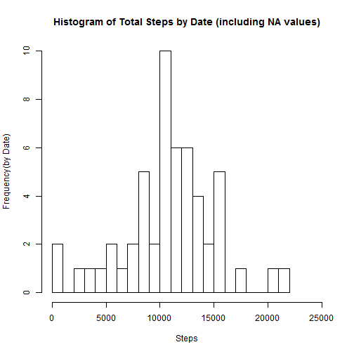

Loading and preprocessing the data

1.Load the data

```r
setInternet2(use = TRUE)
install.packages("knitr", repos="http://cran.rstudio.com", dependencies = TRUE)
```

```
## Error in install.packages : Updating loaded packages
```

```r
library(knitr)
temp <- tempfile()
tst = download.file("https://d396qusza40orc.cloudfront.net/repdata%2Fdata%2Factivity.zip",temp)
data <- read.csv(unz(temp, "activity.csv"))
unlink(temp)
```
2. Process/transform the data (if necessary) into a format suitable for your analysis

```r
library(data.table)
```

```
## Warning: package 'data.table' was built under R version 3.1.1
```

```
## data.table 1.9.2  For help type: help("data.table")
```

```r
data = as.data.table(data)
```

What is mean total number of steps taken per day?

1. make a histogram of total steps by date

```r
sum = data[, list(sum = sum(steps)), by="date"]
```
histogram of total steps by date

```r
#barplot(sum$sum, names.arg=sum$date)
hist(sum$sum, main="Histogram of Total Steps by Date (including NA values)", breaks=20,xlab="Steps", ylab="Frequency(by Date)",xlim=c(0,25000))
```

 

2. Calculate and report the mean and median total number of steps taken per day

```r
avg_by_date = data[, list(which(!is.na(data$steps)), mean = mean(steps), median=as.integer(median(steps))), by="date"]
print(avg_by_date)
```

```
##               date    V1 mean median
##      1: 2012-10-01   289   NA     NA
##      2: 2012-10-01   290   NA     NA
##      3: 2012-10-01   291   NA     NA
##      4: 2012-10-01   292   NA     NA
##      5: 2012-10-01   293   NA     NA
##     ---                             
## 931100: 2012-11-30 17276   NA     NA
## 931101: 2012-11-30 17277   NA     NA
## 931102: 2012-11-30 17278   NA     NA
## 931103: 2012-11-30 17279   NA     NA
## 931104: 2012-11-30 17280   NA     NA
```

What is the average daily activity pattern?
1. Make a time series plot (i.e. type = "l") of 5-minute interval (x-axis) and the avg number of steps taken, across all days (y-axis)

```r
avg_by_int = data[which(!is.na(data$steps)), list(mean = mean(steps), median=as.integer(median(steps))), by="interval"]
na.omit(avg_by_int)
```

```
##      interval      mean median
##   1:        0 1.7169811      0
##   2:        5 0.3396226      0
##   3:       10 0.1320755      0
##   4:       15 0.1509434      0
##   5:       20 0.0754717      0
##  ---                          
## 284:     2335 4.6981132      0
## 285:     2340 3.3018868      0
## 286:     2345 0.6415094      0
## 287:     2350 0.2264151      0
## 288:     2355 1.0754717      0
```

```r
plot(avg_by_int$interval, avg_by_int$mean, type="l", main="Average by Interval across all days", ylab="Mean", xlab="Interval")
```

 

2. Which 5-minute interval, on average across all the days in the dataset, contains the maximum number of steps?

```r
max_interval = avg_by_int$interval[which.max(avg_by_int$mean)]
max_mean     = max(avg_by_int$mean)
```
The max_interval, on average for all days in the dataset is 835 with max_mean 206.1698113.

Imputing missing values

1. Calculate and report the total number of missing values in the dataset (i.e. the total number of rows with NAs)

```r
na_count = sum(is.na(data$steps))
```
The sum of NAs in the dataset is 2304.

2. Devise a strategy for filling in the NAs in the dataset. Replace NAs with mean of the interval across days.

```r
mdata = merge(data, avg_by_int, by="interval")
mdata$steps[is.na(mdata$steps)] = mdata$mean[is.na(mdata$steps)] 
```

3. Create a new dataset that is equal to the original dataset but with the missing data filled in.

mdata is the new dataset containing original dataset with avg interval values replacing the NA values for Steps.

4.Make a histogram of the total number of steps taken each day.
Calculate and report the mean and median total number of steps taken per day.

```r
msum = mdata[, list(sum = sum(steps)), by="date"]
```
histogram of total steps by date

```r
#barplot(msum$sum, names.arg=msum$date)
hist(msum$sum, main="Histogram of Total Steps by Date (filled in NA values)", breaks=20,xlab="Steps", ylab="Frequency(by Date)",xlim=c(0,25000))
```

 

What is the impact of imputing missing data on the estimates of the total daily number of steps?

Dates with NAs for original dataset now have data in new dataset. NA values are replaced by Average Steps by Interval. 

Are there differences in activity patterns between weekdays and weekends?

1. Create new factor in dataset - "weekday" and "weekend".

```r
mdata$type_of_day = as.factor(ifelse(!weekdays(as.Date(mdata$date)) %in% c("Saturday","Sunday"), "weekday", "weekend"))
```

2. Make a panel plot containing a time series plot (i.e. type = "l") of the 5-minute interval (x-axis) 
and the average number of steps taken, averaged across all weekday days or weekend days (y-axis).
The plot should look something like the following, which was creating using simulated data:

```r
avg_by_type = mdata[, list(mean = mean(steps)), by="type_of_day,interval"]
library(ggplot2)
```

```
## Warning: package 'ggplot2' was built under R version 3.1.1
```

```
## Find out what's changed in ggplot2 with
## news(Version == "1.0.0", package = "ggplot2")
```

```r
par(mfrow=c(2,1))
ggplot(avg_by_type,aes(interval, mean)) +geom_line() + facet_grid(type_of_day~.)
```

 

